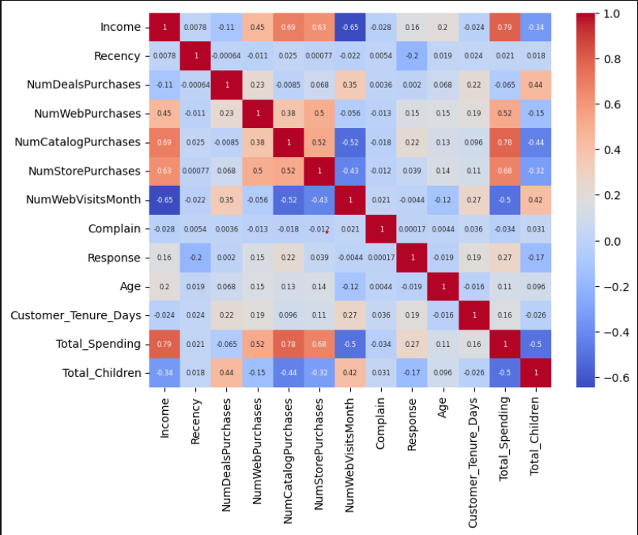
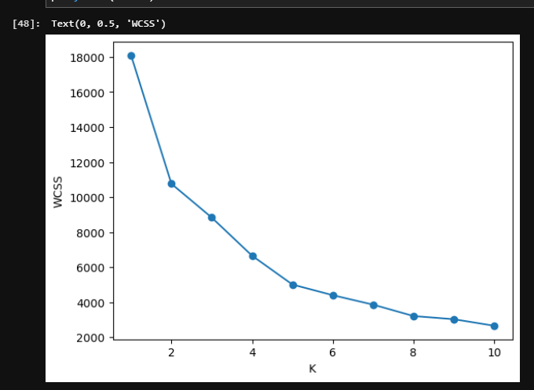
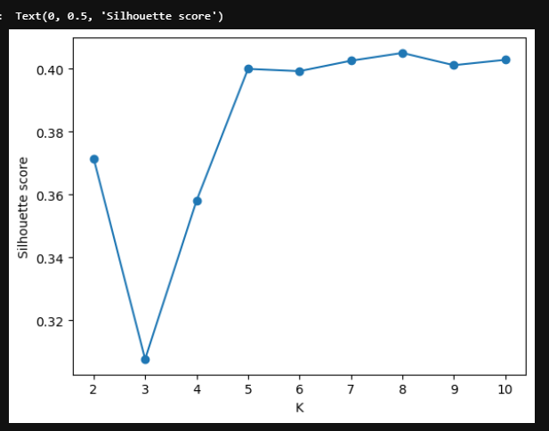
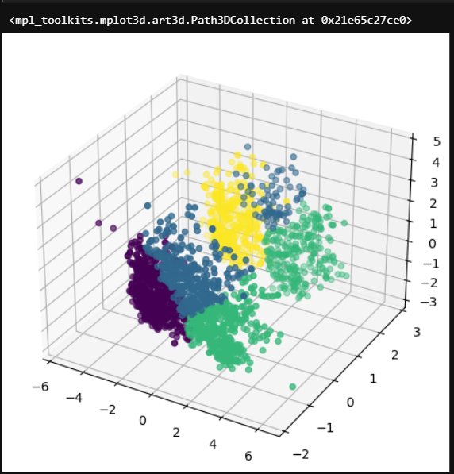
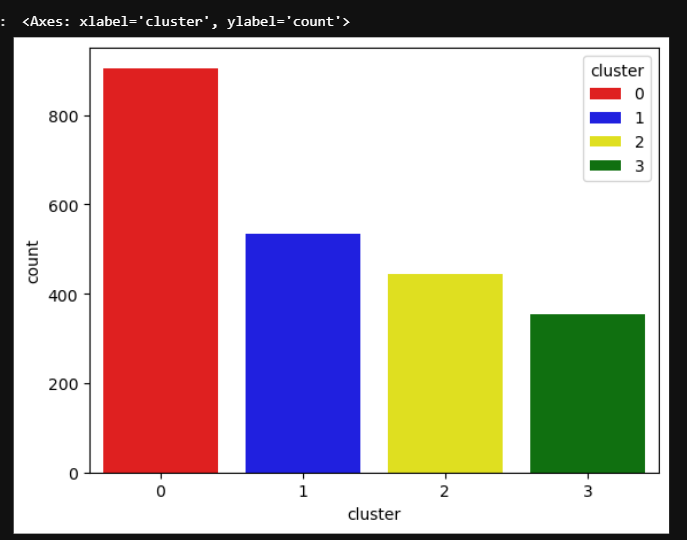

# 🛒 Smart Cart Customer Segmentation using Machine Learning

An end-to-end **Customer Segmentation** project that leverages **Unsupervised Machine Learning** to group customers based on purchasing behavior, demographics, and spending patterns. The project applies data preprocessing, feature engineering, dimensionality reduction, clustering, and visualization to generate actionable business insights.

---

## 📌 Project Overview

Retail businesses collect large amounts of customer data but often struggle to identify meaningful customer groups. This project uses clustering algorithms to segment customers into distinct groups that can be used for:

- Personalized product recommendations
- Targeted marketing campaigns
- Customer retention strategies
- Loyalty program optimization
- Business decision-making

---

## 📊 Dataset

The dataset contains customer information such as:

- Customer Demographics
- Annual Income
- Education Level
- Marital Status
- Spending on Multiple Product Categories
- Customer Tenure
- Campaign Response
- Number of Children
- Purchase History

---

# 📷 Project Visualizations

# 📷 Project Visualizations

## Correlation Heatmap

The correlation heatmap highlights the relationships between numerical features, helping identify feature dependencies and potential correlations within the customer dataset.

<p align="center">
  
</p>

---

## Elbow Method

The Elbow Method was used to determine the optimal number of clusters by analyzing the Within-Cluster Sum of Squares (WCSS) for different values of *K*.

<p align="center">
  
</p>

---

## Silhouette Score

The Silhouette Score evaluates clustering quality by measuring how well each customer belongs to its assigned cluster compared to other clusters.

<p align="center">
  
</p>

---

## 3D PCA Customer Clusters

A 3D visualization of customer segments after applying **Principal Component Analysis (PCA)**. Each color represents a different customer cluster identified by the clustering algorithm.

<p align="center">
  
</p>

---

## Cluster Distribution

This chart shows the number of customers assigned to each cluster, providing an overview of the distribution of customer segments.

<p align="center">
  
</p>

## 🧠 Machine Learning Pipeline

- Data Cleaning
- Missing Value Imputation
- Feature Engineering
- Exploratory Data Analysis (EDA)
- Outlier Detection
- One-Hot Encoding
- Feature Scaling using StandardScaler
- Principal Component Analysis (PCA)
- K-Means Clustering
- Agglomerative Hierarchical Clustering
- Cluster Evaluation using Elbow Method & Silhouette Score
- Cluster Profiling and Business Analysis

---

## ⚙️ Features Engineered

The following business-oriented features were created to improve clustering performance:

- Customer Age
- Customer Tenure
- Total Spending
- Total Children
- Simplified Education Categories
- Simplified Marital Status

---

## 📈 Clustering Techniques

### K-Means Clustering

- Customer segmentation using centroid-based clustering
- Optimal number of clusters identified using the Elbow Method

### Agglomerative Hierarchical Clustering

- Ward linkage for hierarchical clustering
- Compared cluster quality with K-Means

---

## 📊 Model Evaluation

The clustering performance was evaluated using:

- Elbow Method (WCSS)
- KneeLocator
- Silhouette Score
- PCA Visualization
- Cluster Distribution Analysis

---

## 🛠️ Technologies Used

### Programming Language

- Python

### Libraries

- Pandas
- NumPy
- Matplotlib
- Seaborn
- Scikit-learn
- Kneed
- Jupyter Notebook

---

## 📁 Project Structure

```
SMART_CART_CLUSTERING/
│
├── Smart_Cart_Clustering.ipynb
├── smartcart_customers.csv
├── requirements.txt
├── README.md
└── .gitignore
```

---

## 🚀 Results

Successfully segmented customers into **four distinct groups** based on purchasing behavior and demographics. The resulting clusters provide valuable insights that can support:

- Targeted Marketing
- Customer Retention
- Personalized Recommendations
- Business Intelligence
- Sales Strategy

---

## 🔮 Future Improvements

- DBSCAN Clustering
- Gaussian Mixture Models (GMM)
- Interactive Dashboard using Streamlit
- Customer Recommendation System
- Model Deployment using Flask/FastAPI
- Real-Time Customer Segmentation

---

## 💻 How to Run

1. Clone the repository

```bash
git clone https://github.com/your-username/smart-cart-customer-segmentation.git
```

2. Navigate to the project directory

```bash
cd smart-cart-customer-segmentation
```

3. Install dependencies

```bash
pip install -r requirements.txt
```

4. Open the notebook

```bash
jupyter notebook Smart_Cart_Clustering.ipynb
```

---

## 📌 Key Skills Demonstrated

- Machine Learning
- Unsupervised Learning
- Customer Segmentation
- Data Cleaning
- Feature Engineering
- Exploratory Data Analysis (EDA)
- Principal Component Analysis (PCA)
- K-Means Clustering
- Hierarchical Clustering
- Data Visualization
- Business Analytics

---

## 👩‍💻 Author

**Pooja Sabbani**

B.Tech Robotics | Machine Learning Enthusiast

Interested in:
- Machine Learning
- Deep Learning
- Computer Vision
- NLP
- Generative AI

---
⭐ If you found this project useful, consider giving it a star!
